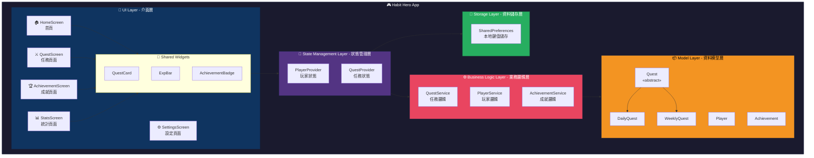
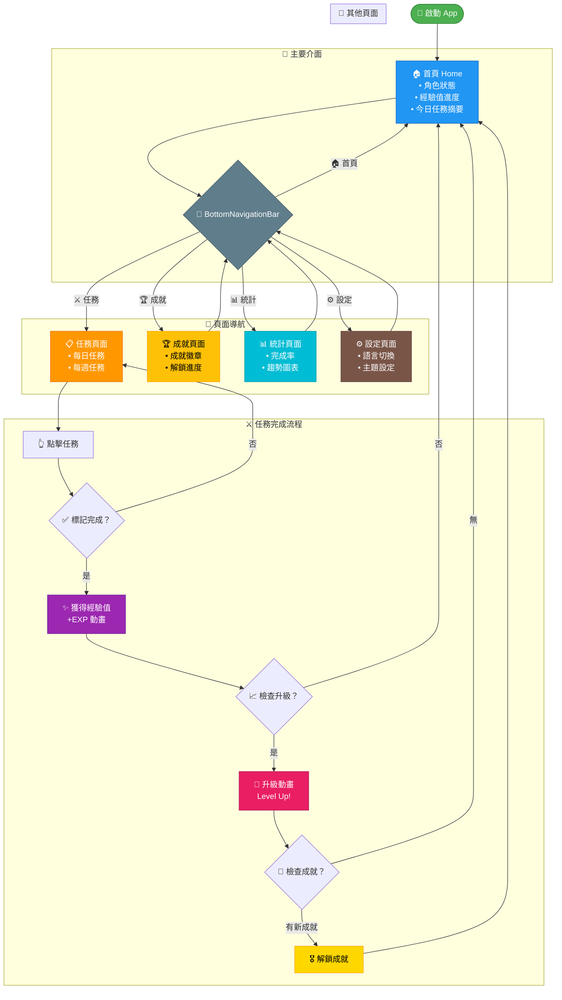
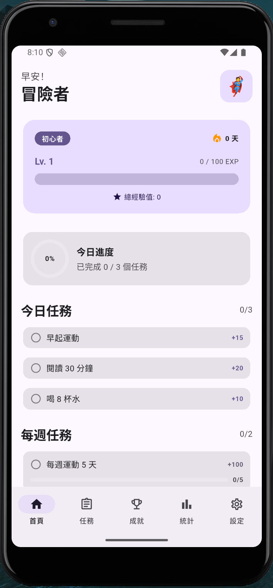
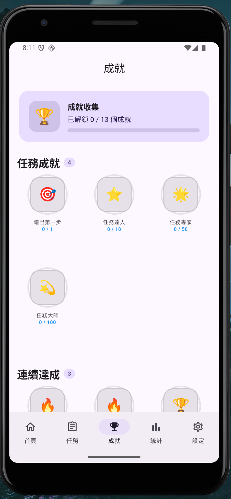
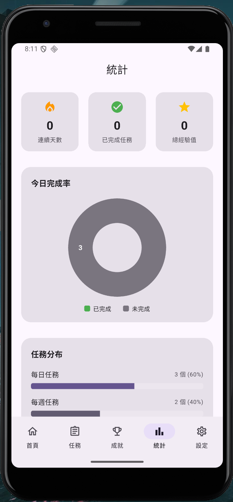

# 114學年第一學期 APP程式設計期末專案成果報告

## 題目：習慣英雄 Habit Hero - 遊戲化習慣養成 APP

### 組員
| 學號 | 姓名 |
|------|------|
| C112151106 | 蔡富城 |

### 日期
115年1月6日

---

## 1. 動機與目的

### 動機
在現代忙碌的生活中，許多人想要養成良好的習慣，卻往往因為缺乏動力或難以持續而放棄。傳統的待辦事項 App 雖然實用，但缺乏趣味性，使用者容易感到枯燥乏味。

我們觀察到遊戲化（Gamification）的概念能夠有效提升使用者的參與度與黏著度。透過將日常習慣轉化為遊戲任務，搭配經驗值、等級、成就系統，能夠讓養成習慣的過程變得更加有趣且具有成就感。

### 目的
1. 開發一款結合遊戲元素的習慣追蹤 App
2. 透過 RPG 遊戲機制（經驗值、等級、成就）提升使用者養成習慣的動力
3. 提供直覺的使用介面，讓使用者能輕鬆管理每日習慣
4. 運用課程所學的 Dart 與 Flutter 技術，實作完整的行動應用程式

---

## 2. 背景說明

### 遊戲化概念
遊戲化（Gamification）是指將遊戲設計元素應用於非遊戲情境中，以提高使用者參與度、動機和忠誠度。常見的遊戲化元素包括：
- **經驗值（EXP）**：完成任務獲得的獎勵點數
- **等級系統**：累積經驗值後升級，給予成就感
- **成就徽章**：達成特定目標後解鎖的獎勵
- **每日任務**：鼓勵使用者每天登入並完成目標

### 技術背景
本專案採用 Google 推出的 Flutter 框架進行開發，使用 Dart 程式語言。Flutter 具有以下優勢：
- 跨平台開發：一套程式碼可同時支援 Android 與 iOS
- 熱重載（Hot Reload）：加速開發效率
- 豐富的 Widget 元件庫：提供美觀的 UI 元件
- 優秀的效能表現：接近原生 App 的執行速度

### 應用的課程知識
| 課程單元 | 應用方式 |
|---------|---------|
| Dart 基礎語法 | 變數、函式、流程控制 |
| 集合與 Null 安全 | List 管理任務、可選欄位處理 |
| 物件導向基礎 | 類別設計、建構子 |
| 物件導向進階 | 工廠建構子、單例模式（GameManager、GameEventService）、運算子重載（Experience） |
| 抽象類別與介面 | 任務抽象類別（Quest）、Mixin 應用（Rewardable、Trackable） |
| Sealed Class | 任務狀態管理（QuestStatus）、遊戲事件類型（GameEvent） |
| 泛型 (Generics) | 泛型型別別名 `Validator<T>`、`AsyncLoader<T>`、`ListFilter<T>` 等 |
| 列舉 (Enum) | 增強列舉：任務難度、分類、成就類型、玩家稱號（含屬性與方法） |
| 例外處理 | 自訂例外階層：`GameException`（基底）、`QuestException`、`PlayerException`、`AchievementException` |
| 非同步程式設計 | Stream 串流（GameEventService）、async/await 資料載入（StorageService） |
| 正規表達式 | Validators 類別驗證玩家名稱、任務標題、Emoji 檢測 |
| typedef | 定義回呼函數類型（QuestCompletionCallback、LevelUpCallback 等） |
| Flutter UI 元件 | BottomNavigationBar、Card、ListView、StreamBuilder、Dismissible 等 |
| 多頁面應用 | 頁面導航與 Provider 狀態管理 |
| 國際化 | 多語言支援（中/英），AppLocalizations 類別 |
| 資料持久化 | StorageService 使用 shared_preferences 實現本地資料儲存 |

---

## 3. 系統架構

### 架構圖



> 📎 **線上檢視**：複製上方程式碼至 [mermaid.live](https://mermaid.live) 可產生互動式圖表

### 架構說明

#### UI Layer（介面層）
- **HomeScreen**：首頁，顯示角色狀態、今日任務摘要、經驗值進度條
- **QuestScreen**：任務頁面，管理每日/每週習慣任務
- **AchievementScreen**：成就頁面，展示已解鎖的成就徽章
- **StatsScreen**：統計頁面，顯示習慣完成率與趨勢圖表
- **SettingsScreen**：設定頁面，語言切換、主題設定

#### State Management Layer（狀態管理層）
- 使用 Provider 進行全域狀態管理
- **PlayerProvider**：管理玩家等級、經驗值、角色資訊
- **QuestProvider**：管理任務列表、完成狀態

#### Business Logic Layer（業務邏輯層）
- **QuestService**：任務相關邏輯（新增、完成、重置）
- **PlayerService**：經驗值計算、升級判定
- **AchievementService**：成就解鎖判定

#### Model Layer（資料模型層）
- 運用抽象類別、繼承、Mixin 設計資料結構
- **Quest（抽象類別）**：任務基底類別
- **DailyQuest / WeeklyQuest**：繼承 Quest 的具體任務類別
- **Player**：玩家角色資料
- **Achievement**：成就資料

#### Storage Layer（資料儲存層）
- 使用 shared_preferences 套件實現本地資料儲存
- 儲存玩家資料（名稱、等級、經驗值、連勝天數）
- 儲存任務列表（每日/每週任務及完成狀態）
- 儲存成就解鎖狀態
- 儲存使用者偏好設定（主題、語言）
- APP 關閉後資料仍會保留，重新開啟時自動載入

---

## 4. 操作流程

### 流程圖



> 📎 **線上檢視**：複製上方程式碼至 [mermaid.live](https://mermaid.live) 可產生互動式圖表

### 流程說明

1. **啟動 App**：進入首頁，顯示玩家角色狀態與今日任務摘要
2. **瀏覽任務**：透過底部導航列切換至任務頁面
3. **完成任務**：點擊任務卡片，標記任務完成
4. **獲得獎勵**：完成任務後獲得經驗值，播放獎勵動畫
5. **升級判定**：經驗值達標時觸發升級，播放升級動畫
6. **成就解鎖**：達成特定條件時解鎖成就徽章
7. **查看統計**：瀏覽習慣完成率與歷史趨勢

---

## 5. 成果說明

### 5.1 功能展示

#### 首頁 (Home Screen)
- 顯示玩家角色頭像與名稱
- 經驗值進度條與當前等級
- 今日任務完成進度
- 最近完成的任務列表

#### 任務頁面 (Quest Screen)
- TabBar 切換每日/每週任務
- 任務卡片顯示名稱、經驗值獎勵、完成狀態
- 滑動刪除任務功能
- FloatingActionButton 新增任務

#### 成就頁面 (Achievement Screen)
- Grid 展示成就徽章
- 已解鎖/未解鎖狀態區分
- 點擊查看成就詳情

#### 統計頁面 (Stats Screen)
- 圓餅圖顯示任務分類占比
- 折線圖顯示每週完成趨勢
- 連續完成天數統計

#### 設定頁面 (Settings Screen)
- 語言切換（中文/English）
- 深色/淺色主題切換
- 角色名稱編輯

### 5.2 技術實作亮點

#### 抽象類別與繼承
```dart
/// 任務抽象類別，搭配 Mixin 使用
abstract class Quest with Rewardable, Trackable {
  final String id;
  String title;
  String description;
  int expReward;
  QuestStatus status;
  final QuestType type;
  final DateTime createdAt;

  Quest({
    required this.id,
    required this.title,
    this.description = '',
    required this.expReward,
    this.status = const Pending(),
    required this.type,
    DateTime? createdAt,
  }) : createdAt = createdAt ?? DateTime.now();

  void complete();  // 抽象方法
  void reset();     // 抽象方法
  bool get isCompleted => status is Completed;
}

/// 每日任務
class DailyQuest extends Quest {
  DailyQuest({
    required super.id,
    required super.title,
    super.description,
    super.expReward = 10,
    super.status,
  }) : super(type: QuestType.daily);

  @override
  void complete() {
    if (status is! Completed) {
      status = QuestStatus.completed();
      markCompleted();  // 來自 Trackable mixin
    }
  }

  @override
  void reset() {
    status = QuestStatus.pending();
    completedAt = null;
  }
}
```

#### Sealed Class 狀態管理
```dart
/// 任務狀態密封類別
sealed class QuestStatus {
  const QuestStatus();

  // 工廠建構子
  factory QuestStatus.pending() => const Pending();
  factory QuestStatus.inProgress() => const InProgress();
  factory QuestStatus.completed() => const Completed();
}

class Pending extends QuestStatus {
  const Pending();
}

class InProgress extends QuestStatus {
  const InProgress();
}

class Completed extends QuestStatus {
  const Completed();
}
```

#### Mixin 功能復用
```dart
/// 獎勵計算 Mixin
mixin Rewardable {
  /// 計算獎勵
  int calculateReward(int baseExp, int multiplier) => baseExp * multiplier;

  /// 根據連勝計算額外獎勵
  int calculateStreakBonus(int baseExp, int streak) {
    if (streak >= 30) return baseExp ~/ 2; // 50% bonus
    if (streak >= 7) return baseExp ~/ 4;  // 25% bonus
    if (streak >= 3) return baseExp ~/ 10; // 10% bonus
    return 0;
  }
}

/// 完成追蹤 Mixin
mixin Trackable {
  DateTime? completedAt;

  /// 標記完成
  void markCompleted() => completedAt = DateTime.now();

  /// 檢查是否今日完成
  bool get isCompletedToday {
    if (completedAt == null) return false;
    final now = DateTime.now();
    return completedAt!.year == now.year &&
        completedAt!.month == now.month &&
        completedAt!.day == now.day;
  }

  /// 取得完成後經過的時間
  Duration? get timeSinceCompletion {
    if (completedAt == null) return null;
    return DateTime.now().difference(completedAt!);
  }
}

// 使用方式：抽象類別搭配 Mixin
abstract class Quest with Rewardable, Trackable { ... }
```

#### 運算子重載
```dart
/// 經驗值類別，展示運算子重載
class Experience {
  final int value;

  const Experience(this.value);

  /// 工廠建構子
  factory Experience.zero() => const Experience(0);

  /// 加法運算子
  Experience operator +(Experience other) => Experience(value + other.value);

  /// 減法運算子
  Experience operator -(Experience other) => Experience(value - other.value);

  /// 比較運算子
  bool operator >(Experience other) => value > other.value;
  bool operator <(Experience other) => value < other.value;
  bool operator >=(Experience other) => value >= other.value;
  bool operator <=(Experience other) => value <= other.value;

  /// 相等運算子
  @override
  bool operator ==(Object other) =>
      identical(this, other) ||
      other is Experience && value == other.value;

  @override
  int get hashCode => value.hashCode;

  @override
  String toString() => '$value EXP';
}
```

#### 單例模式
```dart
class GameManager {
  static final GameManager _instance = GameManager._internal();
  factory GameManager() => _instance;
  GameManager._internal();

  // 全域遊戲狀態管理
}
```

#### 資料持久化（shared_preferences）
```dart
/// StorageService - 資料持久化服務
/// 使用 shared_preferences 實現本地資料儲存
class StorageService {
  static const String _keyPlayerName = 'player_name';
  static const String _keyPlayerLevel = 'player_level';
  static const String _keyPlayerExp = 'player_exp';
  static const String _keyPlayerStreak = 'player_streak';
  static const String _keyDailyQuests = 'daily_quests';
  static const String _keyWeeklyQuests = 'weekly_quests';

  SharedPreferences? _prefs;

  /// 初始化 SharedPreferences
  Future<void> init() async {
    _prefs = await SharedPreferences.getInstance();
  }

  /// 儲存玩家資料
  Future<void> savePlayerData({
    required String name,
    required int level,
    required int exp,
    required int streak,
  }) async {
    await _prefs!.setString(_keyPlayerName, name);
    await _prefs!.setInt(_keyPlayerLevel, level);
    await _prefs!.setInt(_keyPlayerExp, exp);
    await _prefs!.setInt(_keyPlayerStreak, streak);
  }

  /// 讀取玩家名稱
  String getPlayerName() => _prefs!.getString(_keyPlayerName) ?? '冒險者';
  int getPlayerLevel() => _prefs!.getInt(_keyPlayerLevel) ?? 1;
  int getPlayerExp() => _prefs!.getInt(_keyPlayerExp) ?? 0;
}

/// PlayerProvider 使用 StorageService
class PlayerProvider extends ChangeNotifier {
  final StorageService _storage;

  PlayerProvider(this._storage) {
    loadData();
  }

  /// 從儲存載入玩家資料
  void loadData() {
    _player = Player(
      id: 'player_1',
      name: _storage.getPlayerName(),
      level: _storage.getPlayerLevel(),
      totalExp: Experience(_storage.getPlayerExp()),
    );
    notifyListeners();
  }
}
```

#### 列舉定義遊戲常數（增強列舉）
```dart
/// 任務難度等級（增強列舉，含屬性與方法）
enum QuestDifficulty {
  easy('簡單', 1.0, '🟢'),
  normal('普通', 1.5, '🟡'),
  hard('困難', 2.0, '🟠'),
  legendary('傳說', 3.0, '🔴');

  final String label;
  final double expMultiplier;
  final String icon;

  const QuestDifficulty(this.label, this.expMultiplier, this.icon);

  /// 根據難度計算經驗值
  int calculateExp(int baseExp) => (baseExp * expMultiplier).round();
}

/// 任務分類
enum QuestCategory {
  health('健康', '❤️'),
  study('學習', '📚'),
  exercise('運動', '💪'),
  lifestyle('生活', '🏠'),
  social('社交', '👥'),
  creativity('創意', '🎨');

  final String label;
  final String icon;

  const QuestCategory(this.label, this.icon);
}

/// 成就類型
enum AchievementType {
  streak('連續達成', '🔥'),
  total('累計完成', '⭐'),
  level('等級里程碑', '🏆'),
  special('特殊成就', '💎');

  final String label;
  final String icon;

  const AchievementType(this.label, this.icon);
}

/// 玩家稱號等級
enum PlayerRank {
  novice(1, '新手冒險者', '🌱'),
  apprentice(5, '見習勇者', '⚔️'),
  warrior(10, '戰士', '🛡️'),
  master(50, '大師', '👑');

  final int requiredLevel;
  final String title;
  final String icon;

  const PlayerRank(this.requiredLevel, this.title, this.icon);

  /// 根據等級取得對應稱號
  static PlayerRank fromLevel(int level) {
    return PlayerRank.values.lastWhere(
      (rank) => level >= rank.requiredLevel,
      orElse: () => PlayerRank.novice,
    );
  }
}
```

#### 泛型型別別名（Generic Typedef）
```dart
/// 泛型驗證函數
typedef Validator<T> = bool Function(T value);

/// 字串驗證函數（特化 Validator）
typedef StringValidator = Validator<String>;

/// 數值驗證函數
typedef NumberValidator = Validator<num>;

/// 非同步資料載入函數
typedef AsyncLoader<T> = Future<T> Function();

/// 非同步資料儲存函數
typedef AsyncSaver<T> = Future<void> Function(T data);

/// JSON 轉換函數
typedef JsonParser<T> = T Function(Map<String, dynamic> json);

/// 物件轉 JSON 函數
typedef JsonSerializer<T> = Map<String, dynamic> Function(T object);

/// 列表過濾函數
typedef ListFilter<T> = bool Function(T item);

/// 列表排序比較函數
typedef ListSorter<T> = int Function(T a, T b);

// 使用範例
final StringValidator isNotEmpty = (s) => s.isNotEmpty;
final ListFilter<Quest> isCompleted = (q) => q.isCompleted;
```

#### Stream 即時更新 UI（GameEventService）
```dart
/// 遊戲事件類型（使用 Sealed Class）
sealed class GameEvent {
  final DateTime timestamp;
  GameEvent() : timestamp = DateTime.now();
}

/// 經驗值變化事件
class ExpChangedEvent extends GameEvent {
  final int oldExp;
  final int newExp;
  final int delta;

  ExpChangedEvent({required this.oldExp, required this.newExp})
      : delta = newExp - oldExp;
}

/// 等級提升事件
class LevelUpEvent extends GameEvent {
  final int oldLevel;
  final int newLevel;

  LevelUpEvent({required this.oldLevel, required this.newLevel});
}

/// 成就解鎖事件
class AchievementUnlockedEvent extends GameEvent {
  final Achievement achievement;
  AchievementUnlockedEvent({required this.achievement});
}

/// 遊戲事件服務（Singleton + Stream）
class GameEventService {
  static final GameEventService _instance = GameEventService._internal();
  factory GameEventService() => _instance;
  GameEventService._internal();

  // 廣播 StreamController（允許多個監聽者）
  final _eventController = StreamController<GameEvent>.broadcast();

  /// 取得事件串流
  Stream<GameEvent> get eventStream => _eventController.stream;

  /// 取得特定類型的事件串流
  Stream<LevelUpEvent> get levelUpStream =>
      eventStream.where((e) => e is LevelUpEvent).cast<LevelUpEvent>();

  /// 發送等級提升事件
  void emitLevelUp(int oldLevel, int newLevel) {
    _eventController.add(LevelUpEvent(oldLevel: oldLevel, newLevel: newLevel));
  }

  /// 發送成就解鎖事件
  void emitAchievementUnlocked(Achievement achievement) {
    _eventController.add(AchievementUnlockedEvent(achievement: achievement));
  }
}

// 在 UI 中使用 StreamBuilder 監聽升級事件
StreamBuilder<LevelUpEvent>(
  stream: GameEventService().levelUpStream,
  builder: (context, snapshot) {
    if (snapshot.hasData) {
      // 顯示升級動畫或訊息
    }
    return Container();
  },
)
```

#### 自訂例外處理
```dart
/// 遊戲例外基底類別（抽象類別）
abstract class GameException implements Exception {
  final String message;
  final String code;

  const GameException(this.message, this.code);

  @override
  String toString() => '[$code] $message';
}

/// 任務相關例外
class QuestException extends GameException {
  const QuestException(String message) : super(message, 'QUEST_ERROR');

  /// 工廠建構子：任務不存在
  factory QuestException.notFound(String questId) =>
      QuestException('找不到任務: $questId');

  /// 工廠建構子：無效的經驗值
  factory QuestException.invalidExp(int exp) =>
      QuestException('經驗值不可為負數: $exp');

  /// 工廠建構子：無效的任務標題
  factory QuestException.invalidTitle(String title) =>
      QuestException('任務標題無效: $title');
}

/// 玩家相關例外
class PlayerException extends GameException {
  const PlayerException(String message) : super(message, 'PLAYER_ERROR');

  /// 無效的玩家名稱
  factory PlayerException.invalidName(String name, String reason) =>
      PlayerException('無效的玩家名稱「$name」: $reason');
}

/// 成就相關例外
class AchievementException extends GameException {
  const AchievementException(String message) : super(message, 'ACHIEVEMENT_ERROR');

  /// 成就不存在
  factory AchievementException.notFound(String achievementId) =>
      AchievementException('找不到成就: $achievementId');
}

// 使用範例
try {
  if (quest.title.isEmpty) {
    throw QuestException.invalidTitle(quest.title);
  }
} on QuestException catch (e) {
  print(e.toString()); // [QUEST_ERROR] 任務標題無效: ...
}
```

#### 正規表達式驗證輸入
```dart
/// 驗證工具類別
class Validators {
  Validators._(); // 防止實例化

  /// 玩家名稱正規表達式
  /// 規則：2-20 字元，允許中文、英文、數字、底線
  static final RegExp _playerNameRegex =
      RegExp(r'^[\u4e00-\u9fa5a-zA-Z0-9_]{2,20}$');

  /// 任務標題正規表達式
  /// 規則：1-50 字元，不允許特殊符號（除了常見標點）
  static final RegExp _questTitleRegex =
      RegExp(r'^[\u4e00-\u9fa5a-zA-Z0-9\s，。！？、：；()_-]{1,50}$');

  /// 驗證玩家名稱
  static bool isValidPlayerName(String name) {
    if (name.isEmpty) return false;
    return _playerNameRegex.hasMatch(name);
  }

  /// 驗證玩家名稱並返回錯誤訊息
  static String? validatePlayerName(String name) {
    if (name.isEmpty) return '名稱不可為空';
    if (name.length < 2) return '名稱至少需要 2 個字元';
    if (name.length > 20) return '名稱不可超過 20 個字元';
    if (!_playerNameRegex.hasMatch(name)) {
      return '名稱只能包含中文、英文、數字和底線';
    }
    return null; // 驗證通過
  }

  /// 驗證玩家名稱（會拋出例外）
  static void assertValidPlayerName(String name) {
    final error = validatePlayerName(name);
    if (error != null) {
      throw PlayerException.invalidName(name, error);
    }
  }

  /// 檢查是否包含 Emoji
  static bool containsEmoji(String input) {
    final emojiRegex = RegExp(
      r'[\u{1F600}-\u{1F64F}]|'  // Emoticons
      r'[\u{1F300}-\u{1F5FF}]|'  // Misc Symbols and Pictographs
      r'[\u{1F680}-\u{1F6FF}]',   // Transport and Map
      unicode: true,
    );
    return emojiRegex.hasMatch(input);
  }
}

// 使用範例
if (!Validators.isValidPlayerName(inputName)) {
  final error = Validators.validatePlayerName(inputName);
  showErrorDialog(error!);
}
```

#### typedef 定義回呼函數類型
```dart
/// 經驗值計算函數
typedef ExpCalculator = int Function(int baseExp, double multiplier);

/// 任務完成回呼
typedef QuestCompletionCallback = void Function(Quest quest, int expGained);

/// 成就解鎖回呼
typedef AchievementUnlockCallback = void Function(Achievement achievement);

/// 等級提升回呼
typedef LevelUpCallback = void Function(int oldLevel, int newLevel);

/// 錯誤處理函數
typedef ErrorHandler = void Function(Object error, StackTrace stackTrace);

/// 進度更新回呼
typedef ProgressCallback = void Function(double progress);

/// 使用範例
class QuestCard extends StatelessWidget {
  final Quest quest;
  final VoidCallback? onTap;
  final VoidCallback? onComplete;
  final VoidCallback? onDelete;

  const QuestCard({
    super.key,
    required this.quest,
    this.onTap,
    this.onComplete,
    this.onDelete,
  });

  // 元件使用回呼函數處理使用者互動
}
```

### 5.3 畫面截圖

| 首頁 | 任務 | 成就 | 統計 | 設定 |
|:----:|:----:|:----:|:----:|:----:|
|  |  |  |  |  |

---

## 6. 結論

本專案成功開發了一款遊戲化習慣養成 App「習慣英雄 Habit Hero」，將日常習慣追蹤與 RPG 遊戲元素結合，提供使用者更有趣的習慣養成體驗。

### 達成目標
1. **完整的遊戲化機制**：實作經驗值、等級、成就系統
2. **直覺的使用介面**：運用 Flutter 豐富的 Widget 建構美觀 UI
3. **紮實的程式架構**：運用物件導向設計原則，程式碼具有良好的可維護性
4. **課程知識的實踐**：涵蓋本學期所學的 Dart 與 Flutter 技術

### 學習收穫
- 熟練運用 Flutter 框架開發行動應用程式
- 深入理解 Dart 物件導向程式設計（抽象類別、Mixin、Sealed Class）
- 掌握狀態管理與元件間通訊的技巧
- 體驗完整的軟體開發流程

---

## 7. 建議（未來改進方向）

### 功能擴充
1. **社群功能**：加入好友系統，可以查看朋友的習慣完成狀況，互相激勵
2. **雲端同步**：使用 Firebase 實現資料雲端備份與跨裝置同步
3. **推播通知**：提醒使用者完成每日習慣
4. **更多遊戲元素**：加入裝備系統、寵物夥伴、副本挑戰等

### 技術優化
1. **狀態管理升級**：導入 Riverpod 或 BLoC 進行更完善的狀態管理
2. **效能優化**：針對長列表實作虛擬滾動，減少記憶體使用
3. **測試覆蓋**：撰寫單元測試與整合測試，確保程式品質

### 使用者體驗
1. **新手引導**：加入首次使用的教學流程
2. **自訂主題**：讓使用者可以自訂 App 配色
3. **資料匯出**：支援匯出習慣紀錄為 CSV 或 PDF

---

## 8. 參考文獻

1. Flutter 官方文件. https://docs.flutter.dev/
2. Dart 官方文件. https://dart.dev/guides
3. Flutter Widget Catalog. https://docs.flutter.dev/ui/widgets
4. Provider 套件文件. https://pub.dev/packages/provider
5. fl_chart 圖表套件. https://pub.dev/packages/fl_chart
6. shared_preferences 套件文件. https://pub.dev/packages/shared_preferences
7. 課程教材 - APP程式設計, 國立高雄科技大學, 114學年度

---

## 9. 檔案連結

### GitHub Repository

```
https://github.com/TsaiFucheng/app_end
```

### 專案結構
```
app_end/
├── lib/
│   ├── main.dart                    # 程式進入點
│   ├── app.dart                     # App 主體與路由設定
│   │
│   ├── models/                      # 資料模型
│   │   ├── quest.dart               # 任務類別（含 Quest 抽象類別、DailyQuest、WeeklyQuest、QuestStatus）
│   │   ├── player.dart              # 玩家資料
│   │   ├── achievement.dart         # 成就資料
│   │   ├── experience.dart          # 經驗值（運算子重載）
│   │   └── game_enums.dart          # 遊戲列舉（難度、分類、成就類型、稱號等）
│   │
│   ├── screens/                     # 頁面
│   │   ├── home_screen.dart         # 首頁
│   │   ├── quest_screen.dart        # 任務頁面
│   │   ├── achievement_screen.dart  # 成就頁面
│   │   ├── stats_screen.dart        # 統計頁面
│   │   └── settings_screen.dart     # 設定頁面
│   │
│   ├── widgets/                     # 可重用元件
│   │   ├── quest_card.dart          # 任務卡片（含 QuestCard、QuestCardMini、WeeklyQuestCardMini）
│   │   ├── exp_bar.dart             # 經驗值進度條（含 ExpBar、ExpBarCompact）
│   │   └── achievement_badge.dart   # 成就徽章（含 AchievementBadge、AchievementDetailDialog）
│   │
│   ├── providers/                   # 狀態管理
│   │   ├── player_provider.dart     # 玩家狀態管理
│   │   └── quest_provider.dart      # 任務與成就狀態管理
│   │
│   ├── services/                    # 服務層
│   │   ├── game_manager.dart        # 遊戲管理器（單例模式）
│   │   ├── storage_service.dart     # 資料持久化服務（SharedPreferences）
│   │   └── game_event_service.dart  # 遊戲事件服務（Stream 串流）
│   │
│   ├── exceptions/                  # 自訂例外
│   │   └── game_exceptions.dart     # 遊戲例外（含 QuestException、PlayerException、AchievementException、StorageException）
│   │
│   ├── utils/                       # 工具類
│   │   ├── validators.dart          # 正規表達式驗證
│   │   └── typedefs.dart            # typedef 定義
│   │
│   ├── mixins/                      # Mixin
│   │   ├── rewardable.dart          # 獎勵計算 Mixin
│   │   └── trackable.dart           # 完成追蹤 Mixin
│   │
│   └── l10n/                        # 國際化
│       └── app_localizations.dart   # 多語言支援（中/英）
│
├── assets/
│   └── images/
├── pubspec.yaml
└── README.md
```

---

## 10. 附錄

### 組員介紹與分工

#### 組員資訊

| 項目 | 內容 |
|------|------|
| 姓名 | 蔡富城 |
| 學號 | C112151106|
| 系級 | 四資工三甲|
| Email | a0908345017@gmail.com|


#### 分工說明
由於本專案為個人獨立完成，所有工作項目皆由本人負責：

| 工作項目 | 負責人 | 完成度 |
|---------|--------|--------|
| 需求分析與規劃 | 本人 | 100% |
| UI/UX 設計 | 本人 | 100% |
| 資料模型設計 | 本人 | 100% |
| 前端介面開發 | 本人 | 100% |
| 業務邏輯實作 | 本人 | 100% |
| 測試與除錯 | 本人 | 100% |
| 文件撰寫 | 本人 | 100% |

---

### 開發時程

| 週次 | 工作內容 |
|------|---------|
| 第1週 | 需求分析、架構設計 |
| 第2週 | 資料模型實作（Quest、Player、Achievement） |
| 第3週 | 首頁與任務頁面開發 |
| 第4週 | 成就與統計頁面開發 |
| 第5週 | 設定頁面、國際化、主題切換 |
| 第6週 | 測試、除錯、文件撰寫 |

---